<div align="center">
  <h1> Hi, I'm <strong>Prashanth Naidu</strong> (@AvatarN03)</h1>
</div>
<!-- The wave.gif adds a friendly animated waving hand next to your name! -->
<div align="center">
  
</div>
<div align="center">
  
  
  
</div>

---

## 🎯 **About Me**

```typescript
const prashanth = {
    education: "Final Year B.E. Computer Engineering (Mumbai University)",
    focus: ["Web Development", "AI/ML", "Cloud Computing"],
    currentlyLearning: ["Advanced DSA", "NLP", "Mobile Computing"],
    interests: ["Space 🚀", "Psychology 🧠", "Strategy Anime/Manga 📚"],
    goal: "Building scalable applications that solve real-world problems"
};
```


- 🔭 Currently working on **AI-Powered Applications**
- 🌱 Learning **Advanced DSA** and **Machine Learning**
- 👯 Looking to collaborate on **Open Source Projects**
- 🤔 Exploring **Cloud Architecture** and **DevOps**
- 💬 Ask me about **MERN Stack, Next.js, AI/ML**
- ⚡ Fun fact: **Love strategy anime and space exploration!**

---

## 🛠️ **Tech Stack & Arsenal**

<div align="center">

### 🎨 **Frontend Development**


### ⚡ **Backend Development**


### 🗄️ **Database & Cloud**


### 🤖 **AI/ML & Tools**


 

</div>

---

## 🚀 **Featured Projects**

<div align="center">

| 🎯 **Project** | 🛠️ **Tech Stack** | 🌟 **Features** | 🔗 **Links** |
|:---|:---|:---|:---|
| 💬 **Real-Time Chat App** | MERN + Pusher.js | Live messaging, User authentication | [Demo](link) \| [Code](link) |
| 🍴 **Hostel Food Delivery** | MERN Stack | Vendor management, Order tracking | [Demo](link) \| [Code](link) |
| 💰 **Expense Tracker** | Next.js + Clerk + Prisma | Budget analysis, AWS deployment | [Demo](link) \| [Code](link) |
| 📚 **Library Management** | Full Stack | Book management, User dashboard | [Demo](link) \| [Code](link) |
| ✈️ **AI Tour Organizer** | Next.js 14 + AI | Smart itineraries, Location suggestions | [Demo](link) \| [Code](link) |

</div>

---

## 📊 **GitHub Analytics**

<div align="center">
  
  
</div>

<div align="center">
  
</div>

<div align="center">
  
</div>

---

## 🎓 **Learning Journey**

```mermaid
graph TD
    A[🎯 Current Focus] --> B[Advanced DSA in Java]
    A --> C[AI/ML for NLP]
    A --> D[Mobile & Pervasive Computing]
    
    B --> E[Problem Solving]
    C --> F[Semester Projects]
    D --> G[Modern Mobile Apps]
    
    E --> H[Interview Preparation]
    F --> H
    G --> H
    
    H --> I[🚀 Career Ready]
```



<div align="center">
  
### 📈 **Skill Progress**


</div>

---

## 🏆 **GitHub Trophies**

<div align="center">
  
</div>

---

## 🤝 **Let's Connect!**
<div align="center">

[](https://www.linkedin.com/in/prashanth-naidu03/)
[](https://portfolio-in-3-d.vercel.app/)


Click to copy:  
[](mailto:jsprashanth003@gmail.com)


</div>


---

<div align="center">
  
</div>

<div align="center">
  
**💭 "Code is like humor. When you have to explain it, it's bad." - Cory House**

⭐️ **From [AvatarN03](https://github.com/AvatarN03) with ❤️**

</div>

---

<div align="center">
  
</div>
